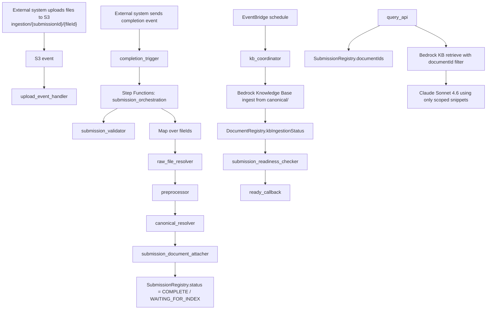

# Multi-Document Ingestion Pipeline

This repository contains an AWS-based proof of concept for ingesting a multi-file external submission into a Bedrock-backed retrieval system, deduplicating documents across submissions, tracking document versions, and exposing submission-scoped retrieval plus model summarization.

The system is intentionally small enough to reason about, but it uses production-shaped building blocks:

- Amazon S3 for document staging and canonical content
- AWS Lambda for event handling and document-processing steps
- AWS Step Functions for submission orchestration
- Amazon DynamoDB for pipeline registries and readiness state
- Amazon Bedrock Knowledge Bases with S3 Vectors for retrieval
- Claude Sonnet 4.6 for scoped-answer generation
- CloudWatch, EventBridge, and SQS for monitoring and operational handling

## What Problem This Solves

An upstream system uploads one or more files for a single user action. Those files arrive independently, but downstream retrieval and summarization need to behave as if the submission were one coherent unit.

This POC solves that by:

- collecting multiple files into a single `submissionId`
- waiting for explicit completion before orchestrating expensive work
- reusing prior work when the same raw file or same normalized document reappears
- creating a new document version when the business document changes
- indexing only the canonical documents that need Bedrock ingestion
- marking a submission `READY` only when all referenced documents are indexed
- filtering retrieval by the submission’s `documentId` set before invoking the model

## Architecture



## Core Design Choices

### 1. Submission completion is explicit

The ingestion path does not assume that “last upload wins” or that a quiet period means a submission is done. The external system must send an explicit completion signal, and only then does Step Functions start the workflow.

Why:

- avoids race conditions across independently arriving files
- keeps orchestration deterministic
- matches real upstream systems better than timer-based guessing

### 2. The pipeline separates transport identity from canonical identity

The implementation distinguishes:

- `fileId`: one delivered file in one submission
- `rawFileHash`: exact raw bytes at the ingestion boundary
- `canonicalHash`: normalized business content after preprocessing
- `documentId`: internal canonical document version used for indexing and retrieval
- `businessDocumentKey`: upstream logical identity for version comparison

Why:

- exact duplicate uploads should reuse work immediately
- semantically identical documents with different raw bytes should still converge
- changed business documents should create a new `documentId` instead of mutating history invisibly

### 3. Bedrock is treated as retrieval/indexing infrastructure, not workflow state

Business readiness lives in DynamoDB and Step Functions. Bedrock is used for:

- indexing canonical content
- retrieving scoped chunks
- grounding the model response

Why:

- DynamoDB gives explicit pipeline state and retry visibility
- Step Functions gives deterministic orchestration and failure boundaries
- Bedrock remains focused on search and answer generation

### 4. Canonical content is plain Markdown in S3

The canonical store keeps ingestible Markdown under `canonical/{documentId}/...`. Registry metadata stays in DynamoDB, not inside the content body.

Why:

- S3 remains the source of truth for indexed content
- Bedrock ingestion remains simple
- canonical metadata can evolve without rewriting content blobs

### 5. Retrieval is scoped by `documentId`

The query path loads `SubmissionRegistry.documentIds`, retrieves from Bedrock with a metadata filter on those document IDs, and only then invokes Sonnet.

Why:

- retrieval isolation is enforced before the model sees any content
- the scoping rule matches the future AgentCore path
- submission membership is explicit and auditable in DynamoDB

## End-to-End Workflow

### Upload and receipt

1. The upstream system uploads files to `ingestion/{submissionId}/{fileId}`.
2. `upload_event_handler` parses the key, creates or updates the submission record, and increments `receivedFileCount` only for new file IDs.
3. The upstream system sends a completion request with the expected file set.

### Submission orchestration

1. `completion_trigger` starts the Step Functions state machine.
2. `submission_validator` confirms that the expected files have arrived.
3. The state machine maps over files and runs:
   - `raw_file_resolver`
   - `preprocessor`
   - `canonical_resolver`
4. `submission_document_attacher` merges resolved `documentId`s onto the submission.

### Raw dedupe

`raw_file_resolver` hashes the exact bytes in S3 and uses `RawFileRegistry` to decide whether:

- this is brand new and should be processed
- the same raw file is already being processed elsewhere
- the same raw file already resolved to an existing `documentId`

### Preprocessing

`preprocessor` is a placeholder normalization step for the sample JSON documents. It:

- parses UTF-8 JSON
- removes `segment_id` fields recursively
- renders the sanitized structure to stable Markdown
- derives `canonicalHash`
- extracts optional business metadata such as `report_id` and `report_date`

### Canonical resolution and versioning

`canonical_resolver` decides whether the normalized content already exists.

- If `canonicalHash` already exists, it reuses the existing `documentId`.
- If the content is new, it creates a new canonical document and writes it to `canonical/{documentId}/`.
- If the upstream logical document key already exists but the content changed, it creates a new `documentId` and marks the latest business version active.

### Knowledge base ingestion

Canonical documents are not ingested inline by the Step Functions request path. Instead:

- new or changed documents are marked `PENDING_INGESTION`
- `kb_coordinator` runs on a schedule or can be invoked directly for testing
- it starts or polls Bedrock ingestion runs
- it updates `DocumentRegistry.kbIngestionStatus`

This keeps submission orchestration from owning long-running Bedrock polling.

### Submission readiness and callback

`submission_readiness_checker` evaluates every document linked to the submission:

- if any document failed ingestion, the submission becomes `FAILED`
- if all documents are `INDEXED`, the submission becomes `READY`
- otherwise it remains `WAITING_FOR_INDEX`

`ready_callback` then records a mock external callback delivery so the sequencing can be validated end to end.

### Scoped query and summarization

`query_api`:

1. loads the submission from DynamoDB
2. reads its `documentIds`
3. calls Bedrock retrieval with a `documentId` filter
4. invokes Sonnet using only the scoped snippets
5. returns retrieval evidence and a short answer

If the model invocation fails, the Lambda returns retrieval results plus a placeholder summary instead of hard-failing the whole response.

## Data Model

The main data model is documented in [docs/data-model.md](/Users/marcus/Working/multi-doc-ingestion-pipeline/docs/data-model.md:1). The key tables are:

### `SubmissionRegistry`

Tracks one external submission lifecycle.

Important fields:

- `submissionId`
- `status`
- `fileIds`
- `documentIds`
- `receivedFileCount`
- `readyAt`
- `callbackStatus`

Statuses:

- `RECEIVING`
- `COMPLETE`
- `WAITING_FOR_INDEX`
- `READY`
- `FAILED`

### `RawFileRegistry`

Tracks exact raw-upload dedupe.

Important fields:

- `rawFileHash`
- `status`
- `processedS3Key`
- `canonicalHash`
- `documentId`

Statuses:

- `NEW`
- `PROCESSING`
- `RESOLVED`
- `FAILED`

### `DocumentRegistry`

Tracks canonical document identity and ingestion state.

Important fields:

- `documentId`
- `canonicalHash`
- `canonicalS3Prefix`
- `businessDocumentKey`
- `sourceUpdatedAt`
- `kbIngestionStatus`
- `isActive`

Statuses:

- `NEW`
- `PENDING_INGESTION`
- `INGESTING`
- `INDEXED`
- `FAILED`

Indexes:

- `canonicalHash-index`
- `businessDocumentKey-index`

### `IngestionRun`

Tracks coordinator-managed Bedrock ingestion runs.

Important fields:

- `ingestionRunId`
- `status`
- `documentIds`
- `kbOperationId`

Statuses:

- `STARTED`
- `SUCCEEDED`
- `FAILED`

## Storage Layout

The document bucket contains three logical areas:

- `ingestion/{submissionId}/{fileId}`
  - raw uploaded source files
- `processed/{submissionId}/{fileId}.md`
  - short-lived normalized artifacts
- `canonical/{documentId}/...`
  - canonical Markdown used for Bedrock ingestion

Lifecycle choices:

- `ingestion/` is transport-oriented and expires after a configured retention window
- `processed/` is short-lived and debugging-oriented
- `canonical/` is the current indexed source of truth

## AWS Technology Choices

### S3

Selected choice:

- one S3 bucket with prefix-based separation for `ingestion/`, `processed/`, and `canonical/`

Pros:

- upstream file delivery
- intermediate normalized artifacts
- canonical source documents for Bedrock ingestion
- simple operational model and IAM surface area
- easy lifecycle management by prefix

Cons:

- one bucket concentrates concerns and policies
- prefix-based isolation is weaker than full bucket isolation
- large-scale environments may prefer separate buckets for clearer blast-radius boundaries

Alternatives:

- separate buckets for raw, processed, and canonical content
  - pros: cleaner separation, easier policy boundaries, easier per-stage retention tuning
  - cons: more IAM complexity, more Terraform resources, more cross-bucket plumbing
- EFS or a database-backed document store
  - pros: useful for workloads that need mutable shared filesystems or richer querying
  - cons: unnecessary complexity for an append-heavy event pipeline with S3-native Bedrock ingestion

### Lambda

Selected choice:

- Lambda per workflow step

Pros:

- good fit for event-driven, mostly short-lived processing
- clear step ownership and isolation
- low idle cost
- straightforward integration with S3, EventBridge, Step Functions, and DynamoDB

Cons:

- too many small Lambdas can spread logic thinly
- packaging and IAM grow more repetitive as the workflow expands
- not ideal for heavier preprocessing, OCR, or long-running content extraction

Alternatives:

- ECS/Fargate tasks
  - pros: better for heavier compute, container dependencies, larger memory/CPU footprints
  - cons: more operational overhead, slower iteration for small event handlers
- one larger “workflow Lambda”
  - pros: fewer deployable units, simpler local comprehension at first
  - cons: weaker separation of concerns, harder retries, blurrier failure boundaries

### Step Functions

Selected choice:

- Step Functions Standard workflow for orchestration

Pros:

- explicit state machine for completion, per-file map execution, retries, and failure handling
- easy to reason about submission lifecycle transitions
- avoids hidden orchestration inside chained Lambda calls

Cons:

- adds workflow-definition complexity
- can feel heavyweight for a very small pipeline
- some state transitions are duplicated in DynamoDB and Step Functions history

Alternatives:

- EventBridge or SQS choreography only
  - pros: more decoupled, potentially cheaper at scale for simpler patterns
  - cons: harder to reason about end-to-end completion, retries, and readiness
- application-managed orchestration in one service
  - pros: full control and fewer AWS orchestration primitives
  - cons: more custom state-handling code, more debugging burden

### DynamoDB

Selected choice:

- DynamoDB tables for explicit workflow and document state

Pros:

- durable explicit state
- idempotent conditional writes
- fast lookups by submission and document identity
- independent tracking of workflow readiness versus retrieval/index status
- natural fit for status registries and dedupe ownership claims

Cons:

- item design and access patterns must be thought through up front
- ad hoc analytics are weaker than in relational stores
- cross-entity consistency must be designed carefully

Alternatives:

- Aurora / PostgreSQL
  - pros: stronger relational modeling, SQL queries, easier ad hoc analysis
  - cons: more operational cost/complexity for a status-registry-heavy workflow
- Redis or ElastiCache
  - pros: fast coordination for ephemeral state
  - cons: poor fit for durable workflow source of truth

### Bedrock Knowledge Bases with S3 Vectors

Selected choice:

- Bedrock Knowledge Base backed by S3 Vectors, ingesting from canonical S3 content

Pros:

- managed retrieval layer without building a custom embedding and vector-stack path
- aligns well with the POC goal of proving scoped retrieval quickly
- clean integration with Bedrock retrieval APIs and model invocation

Cons:

- lifecycle behavior can be slower or more opaque than directly managed infrastructure
- some provisioning and delete paths are less Terraform-native, requiring CloudFormation bridging
- less control over retrieval internals than a bespoke vector stack

Alternatives:

- OpenSearch vector search
  - pros: more direct control, mature search patterns, richer operational knobs
  - cons: more infrastructure to run and tune
- Aurora pgvector or another custom vector store
  - pros: high control and portability, explicit indexing model
  - cons: more engineering work before the POC proves business workflow behavior
- Bedrock Knowledge Base with another supported store
  - pros: can match existing platform constraints
  - cons: would add moving parts without changing the core submission workflow questions much

### Claude Sonnet 4.6

Selected choice:

- Claude Sonnet 4.6 for answer generation after scoped retrieval

Pros:

- strong general-purpose reasoning and synthesis for snippet-grounded answers
- clean fit for “answer only from retrieved context” behavior
- available through the Bedrock invocation path already used by the POC

Cons:

- model access and inference-profile availability are account-dependent
- answer quality is still bounded by retrieval quality and preprocessing quality
- more expensive than a retrieval-only validation path

Alternatives:

- retrieval only, no summarization
  - pros: simplest way to validate scoping and evidence
  - cons: does not prove the downstream model path
- a smaller Bedrock model
  - pros: lower cost, potentially lower latency
  - cons: weaker synthesis for noisy or partial snippets
- future AgentCore Runtime entry point
  - pros: closer to final agent architecture
  - cons: more moving parts before the POC core is validated

### EventBridge + SQS + CloudWatch

Selected choice:

- EventBridge for schedules, SQS for manual-review queueing, CloudWatch for logs/metrics/alarms

Pros:

- EventBridge schedules the KB coordinator and ops monitor
- SQS acts as the manual-review inbox for stale or failed pipeline states
- CloudWatch stores logs, dashboards, alarms, and custom operational metrics
- uses standard AWS operational primitives with low integration overhead

Cons:

- operational context is spread across several AWS consoles and services
- SQS is only a queue, not a human workflow system
- richer observability may eventually need a dedicated tracing or analytics layer

Alternatives:

- no SQS, logs and alarms only
  - pros: simplest operational setup
  - cons: failures are easier to miss and harder to triage durably
- PagerDuty/Jira/Slack-first incident routing
  - pros: stronger human workflow integration
  - cons: more external dependencies for a POC
- Step Functions-only monitoring
  - pros: fewer services
  - cons: weak coverage for non-orchestration issues like stale indexed state

## Architecture Review

### What is strong in this design

- The identity model is the strongest part of the architecture. Separating `rawFileHash`, `canonicalHash`, `documentId`, and `businessDocumentKey` makes dedupe and versioning behavior explicit instead of accidental.
- Submission readiness is modeled independently from indexing internals. That keeps the business contract clear: a submission is ready only when its linked documents are ready.
- The retrieval boundary is in the right place. Scoping happens before model invocation, which is safer and easier to audit than asking the model to self-police scope.
- The pipeline is resilient to retries. DynamoDB ownership claims, explicit statuses, and Step Functions boundaries all help with idempotency.

### Main tradeoffs and risks

- The current preprocessing step is intentionally simplistic. The overall architecture is solid, but content quality is still limited by placeholder JSON-to-Markdown conversion.
- The Bedrock Knowledge Base lifecycle is the least predictable part of the stack operationally. The scratch-rebuild work proved that the ingestion path is viable, but teardown and asynchronous service behavior need care.
- The solution uses multiple state systems at once: Step Functions, DynamoDB, S3, and Bedrock. That is appropriate here, but it means debugging requires disciplined observability.
- The current query entry point is Lambda-based rather than a full agent runtime surface, so there is still a small gap between validated POC behavior and eventual production packaging.

### What I would revisit beyond the POC

- Move from placeholder preprocessing to document-type-specific parsers and OCR where needed.
- Decide whether Bedrock Knowledge Bases remain the long-term retrieval substrate or whether direct control over the vector layer becomes more valuable.
- Revisit whether manual-review SQS should evolve into a richer operator workflow with automated remediation or ticketing integration.
- Consider whether the number of Lambda functions should stay this granular or whether some adjacent steps should be grouped once the behavior stabilizes.

## Known Limitations and Tradeoffs

### Current limitations

- The preprocessing layer currently assumes JSON-like structured content and renders it into Markdown. That is enough to prove identity and workflow behavior, but it is not a complete ingestion strategy for PDFs, Office docs, scans, or highly irregular source files.
- The query path still includes a placeholder fallback summary when model invocation fails. This is useful for resilience and validation, but it is not the same as a fully productized answer path.
- The ready callback is mocked inside the AWS stack rather than calling a real external system. That proves sequencing, not network integration hardening.
- Submission completion depends on an explicit completion trigger. This is the right design for determinism, but it assumes the upstream system can provide trustworthy expected-file information.
- Operational handling is intentionally lightweight. The manual-review queue proves durable issue capture, but it is not a full operator case-management system.

### Deliberate tradeoffs

- The design favors explicitness over minimal component count. That means more moving parts than a monolithic worker, but much clearer workflow state and retry boundaries.
- The design favors canonical reuse and correctness over the lowest possible ingest latency. A raw file takes more steps before it becomes searchable, but those steps prevent avoidable reprocessing and make versioning auditable.
- The design favors managed Bedrock capabilities over maximum control. That accelerates the POC, but it leaves some retrieval and lifecycle behavior less tunable than a custom vector stack.
- The design favors DynamoDB registries over relational joins. That simplifies high-throughput key-value workflow access, but it moves more responsibility onto careful item modeling and explicit access-pattern design.

### Failure and edge-case considerations

- If upstream ordering metadata such as `sourceUpdatedAt` is weak or missing, “latest active document” behavior becomes less trustworthy.
- If preprocessing quality is poor, canonical dedupe quality and retrieval quality both degrade together.
- If the KB coordinator falls behind, submissions can accumulate in `WAITING_FOR_INDEX` even though orchestration completed correctly.
- If document counts per submission grow substantially, the `SubmissionRegistry.documentIds` list may eventually want to move into a dedicated mapping table.

## Production Scaling Expectations

### What should scale reasonably well as designed

- S3-based ingestion and canonical storage should scale comfortably for much higher file counts than the POC currently exercises.
- DynamoDB-backed submission, raw-file, document, and ingestion-run registries are a good fit for high read/write concurrency as long as access patterns remain key-based.
- Step Functions fan-out across files is a reasonable baseline for medium-volume multi-file submissions.
- The dedupe model should become more valuable with scale because repeated content stops consuming proportional preprocessing and indexing work.

### Where the current design will feel pressure first

- Bedrock Knowledge Base ingestion cadence is likely to become the first bottleneck if submission volume or document-churn rate rises significantly.
- Placeholder preprocessing will become a real constraint once source types diversify or document size and complexity increase.
- Scheduled polling by `kb_coordinator` and `ops_monitor` is fine for a POC, but at higher scale it may introduce more lag than desired between indexing completion and submission readiness.
- Lambda-per-step packaging and IAM management may become cumbersome as the number of handlers, document types, and environment variants grows.

### Expected production-oriented evolutions

- Replace placeholder preprocessing with specialized parsers, OCR, schema-aware extraction, and better normalization contracts.
- Reassess the retrieval substrate if control, observability, or ingestion throughput becomes more important than managed convenience.
- Introduce stronger submission-to-document mapping structures if document fan-out grows or if per-submission mutation patterns become more complex.
- Tighten observability with tracing, richer metrics, and clearer operator workflows rather than relying mainly on logs, alarms, and SQS review items.
- Consider event-driven readiness advancement or more adaptive coordinator behavior if the scheduled polling model creates too much latency.

### Rough traffic expectations

These are sizing estimates, not hard guarantees. They assume:

- small-to-medium submissions, typically 1-10 files each
- moderate chunk counts per document rather than very large PDFs or OCR-heavy payloads
- dedupe remains valuable, so not every incoming file becomes a brand-new document to index
- default scheduled coordination rather than aggressive real-time ingestion tuning

| Traffic level | Approximate shape | Expected behavior | Likely bottleneck | Recommended action |
| --- | --- | --- | --- | --- |
| Light | up to low hundreds of submissions/day | Should be comfortable with the current design | None likely if documents are modest | Operate as-is, monitor readiness lag |
| Moderate | roughly `5-20` sustained submissions/hour | Still reasonable for the current POC architecture | Bedrock indexing lag may become visible first | Watch `WAITING_FOR_INDEX` backlog and KB run cadence |
| Heavy-but-plausible | consistent tens of submissions/hour or high hundreds to low thousands/day | Usable, but likely to show readiness delays when novelty is high | KB coordinator cadence and Bedrock ingestion throughput | Plan uplift, reduce polling lag, improve observability |
| High scale | sustained high-double-digit or triple-digit submissions/hour | Not a comfortable target for the current shape without changes | Managed retrieval/indexing path, scheduler cadence, operational handling | Redesign for higher-throughput ingestion and tighter readiness control |

Comfortable range with the current shape:

- low hundreds of submissions per day should be very comfortable
- a sustained rate around 5-20 submissions per hour should still be well within the intended POC operating range
- short bursts above that are likely fine as long as new canonical-document creation stays modest and Bedrock ingestion is not constantly backlogged

Range where I would start planning uplift:

- consistent tens of submissions per hour with many net-new canonical documents per submission
- daily traffic in the high hundreds to low thousands of submissions, especially if most files are unique and need indexing
- workloads where “submission ready” latency needs to stay tight even while the Knowledge Base is continuously ingesting new material

Range where this design needs deliberate production upgrades rather than just bigger quotas:

- sustained high-double-digit or triple-digit submissions per hour
- submissions with large document sets or very large source files
- environments where many tenants or upstream systems are feeding the same stack concurrently
- use cases that require near-real-time readiness after upload rather than scheduler-paced indexing

The first component likely to force uplift is Bedrock ingestion coordination, not S3 or DynamoDB. In practical terms:

- S3 event intake and DynamoDB state tracking should scale beyond the current POC needs comfortably
- the KB coordinator, scheduler cadence, and downstream Bedrock indexing throughput are the parts most likely to determine real system capacity
- if most inbound files are duplicates, the system will scale much better than raw submission counts alone would suggest
- if most inbound files are novel and large, the system will need uplift sooner even at moderate submission volume

### Practical production expectation

This architecture is a strong production-shaped foundation for:

- deterministic multi-file submission handling
- explicit dedupe and document versioning
- submission-scoped retrieval over canonical content
- operationally visible readiness transitions

It is not yet production-complete for:

- broad unstructured-document ingestion
- high-volume operator workflows
- strict latency targets on indexing-to-ready transitions
- deep retrieval tuning and lifecycle control

In other words, the workflow and identity model are close to production quality, while the preprocessing depth, retrieval substrate choices, and operational polish are still intentionally POC-grade.

## Operational Model

Phase 15 introduced operational hardening components:

- FIFO manual-review queue with DLQ
- `ops_monitor` Lambda
- CloudWatch alarms for orchestration failures and stuck state
- CloudWatch operations dashboard

The manual-review queue is not part of the main data path. It is the durable holding area for operational issues such as:

- failed preprocessing
- failed ready callbacks
- stale submissions
- documents stuck in `INGESTING`

## Validation Status

The current implementation has been validated through the Phase 16 exit checklist.

Validated behaviors:

- Terraform can recreate the environment from scratch
- a manual multi-file submission completes successfully
- exact raw-file duplicates reuse the same `documentId`
- canonical duplicates with different raw bytes still reuse the same `documentId`
- business-document updates create a new version and become active
- Bedrock ingestion completes for changed documents
- scoped retrieval stays isolated to the submission’s `documentId` set
- Sonnet invocation succeeds using only scoped retrieval results

Remaining manual item:

- team walkthrough and open-issues capture

See [implementation-runbook.md](/Users/marcus/Working/multi-doc-ingestion-pipeline/implementation-runbook.md:460) for the phase-by-phase build history and validation notes.

## Repository Layout

```text
.
├── README.md
├── design.md
├── docs/
│   └── data-model.md
├── sample/
│   ├── *.json
│   └── submissions/
├── scripts/
│   ├── upload_test_submission.py
│   ├── trigger_completion.py
│   ├── poll_submission.py
│   ├── invoke_scoped_query.py
│   ├── validate_phase14.py
│   └── validate_phase16.py
├── src/
│   └── lambdas/
└── terraform/
    ├── main.tf
    ├── variables.tf
    ├── outputs.tf
    └── templates/
```

## Deployment

### Prerequisites

- AWS account with Bedrock Knowledge Base and model access in `us-east-1`
- Terraform installed locally
- Python 3 available for the validation scripts
- Bedrock access to:
  - `amazon.titan-embed-text-v2:0`
  - `anthropic.claude-sonnet-4-6`
  - inference profile `us.anthropic.claude-sonnet-4-6`

### Terraform configuration

Start from [terraform/terraform.tfvars.example](/Users/marcus/Working/multi-doc-ingestion-pipeline/terraform/terraform.tfvars.example:1).

Example flow:

```bash
cp terraform/terraform.tfvars.example terraform/terraform.tfvars
terraform -chdir=terraform init
terraform -chdir=terraform apply -input=false -auto-approve
```

Useful outputs include:

- document bucket name
- DynamoDB table names
- Lambda names
- Bedrock Knowledge Base ID and data source ID
- manual-review queue URL
- operations dashboard name

## Running the Validation Tooling

Operator scripts are documented in [scripts/README.md](/Users/marcus/Working/multi-doc-ingestion-pipeline/scripts/README.md:1).

Common flows:

```bash
python3 scripts/validate_phase14.py --drive-kb-coordinator
python3 scripts/validate_phase16.py --run-id demo-exit --drive-kb-coordinator
python3 scripts/validate_phase16.py --run-id demo-fresh --drive-kb-coordinator --validated-fresh-create
```

The sample manifests under `sample/submissions/` exercise:

- baseline multi-file submission
- independent second submission
- exact raw duplicate reuse
- canonical duplicate reuse
- business-document version update

## Known POC Boundaries

This repo is intentionally still a POC. Important simplifications remain:

- preprocessing is JSON-specific placeholder logic, not a general parser/OCR pipeline
- the external ready callback is mocked by a Lambda instead of a real outbound HTTP integration
- the query path is a direct Lambda entry point rather than a full AgentCore Runtime surface
- the summary path includes a placeholder fallback when the model cannot be invoked

Those choices are deliberate: the POC proves identity, dedupe, versioning, readiness, indexing, and retrieval isolation before investing in richer parsing and agent orchestration layers.
