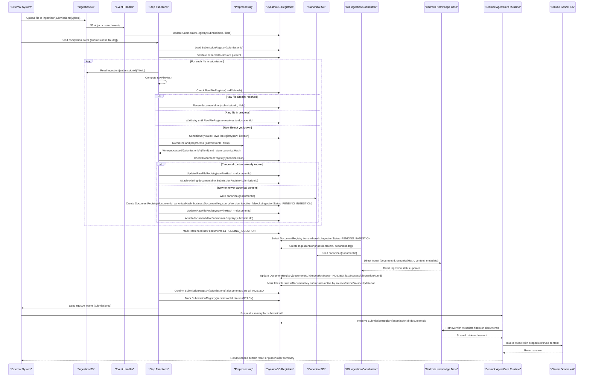

# POC Design: External Document Set Ingestion to Bedrock Knowledge Base

## 1. Purpose

This POC integrates with an external system that uploads one or more files for a single user action. Files arrive sequentially into AWS S3. The POC must:

- detect when the full file set for a submission is complete
- ingest only the required documents into Amazon Bedrock Knowledge Bases
- avoid re-ingesting identical documents across submissions
- support updated documents without forcing a full rebuild
- notify the external system when the submission is ready
- later support an AgentCore-based summarization call scoped to the correct submission

The POC itself is a single trusted system. "Multiple users" refers to end users in the external system, not multiple tenants inside the POC.

## 2. Design Goals

- Keep the implementation minimal for the POC
- Use production-ready concepts so the design scales cleanly
- Make completion deterministic
- Treat Bedrock Knowledge Base as the indexing and retrieval layer, not the business workflow engine
- Reuse document embeddings where content is identical
- Preserve a clean path to support document updates and retries

## 3. Recommended Architecture

### Core services

- Amazon S3 document bucket with staged prefixes
- preprocessing Lambda or container task
- Amazon EventBridge or SQS for upload events
- AWS Lambda for event handling and small processing tasks
- AWS Step Functions for submission orchestration
- Amazon DynamoDB for submission and document registries
- Amazon Bedrock Knowledge Base for indexing and retrieval
- Amazon Bedrock AgentCore Runtime for summarization and scoped search
- Amazon Bedrock model invocation using Anthropic Claude Sonnet 4.6
- Amazon CloudWatch for logs, alarms, and metrics

### High-level pattern

- The external system uploads files to an ingestion prefix under a submission-specific prefix using unique file IDs.
- The external system sends a final manifest or explicit completion event.
- Step Functions starts only after submission completion is declared.
- The workflow uses a raw file registry to collapse repeated identical source deliveries where possible.
- The workflow preprocesses each raw file into a normalized representation before canonicalization.
- The workflow resolves each preprocessed file into either:
  - an already-known canonical document, or
  - a new or updated canonical document that must be ingested
- Step Functions writes canonical documents to S3, records changed canonical documents as pending direct ingestion, and then waits for document-level readiness.
- A separate Knowledge Base ingestion coordinator batches changed canonical documents into direct ingestion work so the design remains efficient as submission volume grows.
- Once ingestion is complete, the POC sends a "ready" event back to the external system.
- Later, the external system invokes an Amazon Bedrock AgentCore Runtime workflow to retrieve and search only the documents associated with that submission, and to call Anthropic Claude Sonnet 4.6 for placeholder summarization behavior.

## 4. Storage Model

### 4.1 Document bucket

Purpose:

- holds raw, processed, and canonical document states in separate prefixes
- keeps the POC simple while preserving clear lifecycle boundaries
- provides the storage input for preprocessing and the mirrored source of record for Knowledge Base content

Recommended settings:

- no bucket versioning for the POC
- one bucket with three main prefixes:
  - `ingestion/{submissionId}/{fileId}`
  - `processed/{submissionId}/{fileId}`
  - `canonical/{documentId}`

Why:

- fewer AWS resources and policies for the POC
- simpler scripting and operational setup
- logical separation is still preserved through prefixes
- lifecycle can still be managed independently by prefix

Lifecycle policy by prefix:

- `ingestion/`
  - short retention
  - expire objects after a defined window such as 7 to 30 days
  - treat as a transport boundary, not a long-term archive
- `processed/`
  - very short retention
  - expire quickly after successful canonicalization, such as 1 to 7 days
  - retain only long enough for troubleshooting and replay of preprocessing issues
- `canonical/`
  - retained as the current indexed source of truth
  - no automatic expiry for active documents in the POC

Rollback responsibility should remain with the upstream system rather than relying on long-term raw file history inside this POC.

### 4.2 Processed staging area

Purpose:

- holds the normalized output of preprocessing
- separates raw-file delivery from canonical document identity
- provides the stable input used for canonical hashing

Recommended settings:

- use a clearly separated prefix inside the document bucket
- prefix layout such as `processed/{submissionId}/{fileId}`
- lifecycle expiry after processing is complete unless retention is needed for debugging

Typical preprocessing may include:

- format normalization
- text extraction
- OCR if required
- removal of delivery-specific metadata or wrappers
- stable serialization for hashing and downstream ingestion

Why:

- the same raw file may produce the same normalized business content
- canonical dedupe should happen on normalized content, not only raw file bytes
- preprocessing is the correct place to strip out noise that would otherwise create false document versions

### 4.3 Canonical area

Purpose:

- source of truth for the current document content
- mirrored copy of what is directly ingested into Bedrock Knowledge Base

Recommended settings:

- one logical object per canonical document
- prefix layout such as `canonical/{documentId}`
- keep business lifecycle in DynamoDB, not in raw object naming

Why:

- avoids duplicate storage for identical content
- keeps Knowledge Base content mirrored in S3 for audit and reconciliation
- supports controlled updates

For the POC, the canonical area should behave as a clean current-state store. The `ingestion/` prefix carries short-lived transport input, the `processed/` prefix carries short-lived normalized intermediates, and the `canonical/` prefix carries the approved indexed form.

## 5. State and Metadata Model

### 5.1 Core identity model

The design uses separate identities for transport, normalized content, and business lifecycle so duplicate delivery, canonical reuse, and updates can be handled independently.

| Field | Meaning | Used for |
| --- | --- | --- |
| `submissionId` | One external user action containing one or more files | workflow tracking and readiness |
| `fileId` | Unique identifier for a file arrival within a submission | storage keying and event correlation |
| `rawFileHash` | Hash of the raw uploaded file bytes | exact duplicate delivery detection at the ingestion boundary |
| `canonicalHash` | Hash of the normalized preprocessed content | canonical dedupe and embedding reuse |
| `documentId` | Internal identifier for a canonical document version | storage, ingestion, retrieval, and submission linking |
| `businessDocumentKey` | External logical document identifier if provided | grouping versions of the same business document |
| `sourceVersion` or `sourceUpdatedAt` | External ordering signal from the source system | deciding which update is authoritative |

Design intent:

- `fileId` answers "which uploaded object are we processing?"
- `rawFileHash` answers "have we seen this exact delivery before?"
- `canonicalHash` answers "does this normalize to content we already know?"
- `businessDocumentKey` answers "is this the same logical external document?"

### 5.2 Submission registry table

One item per submission.

Suggested attributes:

- `submissionId` (PK)
- `externalRequestId`
- `status`
- `expectedFileCount`
- `receivedFileCount`
- `manifestReceived`
- `ingestionPrefix`
- `fileIds`
- `documentIds`
- `readyAt`
- `callbackStatus`
- `createdAt`
- `updatedAt`

Purpose:

- tracks workflow progress for each external user action
- acts as the source of truth for what belongs to a submission

### 5.3 Raw file registry table

One item per exact raw file payload, used only at the ingestion boundary.

Suggested attributes:

- `rawFileHash` (PK)
- `status`
- `processedS3Key`
- `canonicalHash`
- `documentId`
- `firstSeenAt`
- `lastSeenAt`
- `updatedAt`

Purpose:

- collapses repeated identical source deliveries before expensive downstream work
- allows safe reuse when the same exact file is resent by the upstream system
- keeps transport-level dedupe separate from canonical document identity

Recommended behavior:

- if a raw file hash already exists with a resolved `documentId`, Step Functions can reuse that mapping for the current `submissionId` and `fileId`
- if a raw file hash exists but is still being processed, the current workflow should wait or retry until the raw file resolves to a `documentId`
- if a raw file hash does not exist, the current workflow claims ownership through a conditional write and performs preprocessing

Assumption for the POC:

- identical raw bytes from the same upstream system are safe to treat as the same transport payload

If that assumption changes later, the registry key can be expanded to include upstream document context in addition to `rawFileHash`.

### 5.4 Document registry table

One item per canonical document version, with lookup support for reuse.

Suggested attributes:

- `documentId` (PK)
- `canonicalHash`
- `businessDocumentKey` if the external system provides one
- `sourceVersion` or `sourceUpdatedAt` if the external system provides one
- `canonicalS3Key`
- `kbIngestionStatus`
- `pendingIngestionRunId`
- `lastSuccessfulIngestionRunId`
- `lastIngestionError`
- `isActive`
- `createdAt`
- `updatedAt`

Recommended `kbIngestionStatus` values:

- `NEW`
- `PENDING_INGESTION`
- `INGESTING`
- `INDEXED`
- `FAILED`

Recommended secondary lookup:

- by `canonicalHash` for normalized-content duplicate detection
- optionally by `businessDocumentKey` for update/version handling

Purpose:

- drives canonical dedupe
- tracks the current active document for a business key
- records whether a document is already indexed

### 5.5 Ingestion run table

One item per Knowledge Base ingestion run managed by the coordinator.

Suggested attributes:

- `ingestionRunId` (PK)
- `status`
- `kbOperationId`
- `documentIds`
- `startedAt`
- `completedAt`
- `errorSummary`

Purpose:

- provides auditability for ingestion batches
- allows retry and failure analysis without overloading the document record
- gives a stable bridge between coordinator activity and document readiness

### 5.6 Submission-document mapping

For the POC, this can be stored directly on the submission item as a list of `documentId`s if submission sizes are small.

For production evolution, this can become a dedicated mapping table:

- `submissionId`
- `documentId`
- `role` or `sourceFilename`
- `attachedAt`

## 6. Completion and Orchestration Design

### 6.1 Why Step Functions

Step Functions is the right orchestration layer because the workflow has:

- asynchronous file arrival
- clear state transitions
- conditional branching for reuse vs ingest
- waiting for document-level readiness after registration for ingestion
- retries for callback delivery
- need for auditability

This is more reliable and maintainable than chaining Lambdas together.

### 6.2 Recommended completion contract

Best option:

- the external system sends an explicit manifest or completion signal after the final file upload

Manifest content should include:

- `submissionId`
- expected file count
- `fileId` values for each expected file
- optional original filenames as metadata only
- optional checksums

Why:

- deterministic
- avoids timeout-based guessing
- easiest to explain operationally

Fallback option:

- infer completion after a period of upload inactivity

This should be avoided for the primary design because it is operationally fragile.

### 6.3 State machine flow

Recommended Step Functions states:

1. `SubmissionCompleteReceived`
2. `LoadSubmissionState`
3. `ValidateManifestAndFilesPresent`
4. `DetectRawDuplicateFiles`
5. `PreprocessFiles`
6. `ResolveCanonicalDocuments`
7. `ClassifyDocuments`
8. `PersistNewOrUpdatedCanonicalObjects`
9. `RegisterPendingIngestion`
10. `WaitBeforeStatusCheck`
11. `CheckDocumentReadiness`
12. `MarkSubmissionReady`
13. `NotifyExternalSystemReady`
14. `Success`

Failure branches:

- `SubmissionInvalid`
- `KnowledgeBaseIngestionFailed`
- `CallbackFailed`
- `ManualReviewRequired`

### 6.4 Minimal POC implementation

For the POC, Step Functions should start only when the manifest or completion event arrives. Do not start a long-running state machine on the first uploaded file and leave it waiting for an unknown duration.

Use a simpler split:

- S3 upload events update the submission registry through Lambda
- completion event starts the Step Functions execution
- Step Functions drives the post-completion lifecycle through document readiness
- a separate KB coordinator is responsible for starting and monitoring direct ingestion runs

This keeps the workflow compact while preserving a production-ready model.

To keep the design scalable, the state machine should not assume that every completed submission immediately starts its own direct ingestion request. The state machine should resolve documents and register any new or updated canonical documents for ingestion, then wait on document-level ingestion status. This allows multiple submissions that depend on the same new canonical document to converge on the same downstream ingestion work while leaving ingestion execution to the coordinator.

## 7. Reuse and Update Strategy

### 7.1 Exact duplicate reuse

Each uploaded file should be evaluated at two levels:

- `rawFileHash`: hash of the raw bytes received from the external system
- `canonicalHash`: hash of the normalized preprocessed document that represents business content

Processing rule:

- if `rawFileHash` already exists in `RawFileRegistry` and is known to map to the same previously processed result:
  - skip preprocessing work where safe
  - attach the existing canonical document mapping to the submission
- if preprocessing is required or if a raw duplicate cannot be trusted directly, preprocess the file and compute `canonicalHash`
- if `canonicalHash` already exists in `DocumentRegistry`:
  - do not ingest again
  - attach the existing `documentId` to the submission
- if `canonicalHash` does not exist:
  - create a new canonical document
  - write it to the canonical area
  - mark it as pending direct ingestion into the Knowledge Base

This allows multiple submissions to reference the same canonical document and the same embeddings.

To make this safe under concurrent arrivals:

- `RawFileRegistry` must use conditional writes keyed by `rawFileHash` so only one workflow claims preprocessing ownership for an exact duplicate raw file
- `DocumentRegistry` must use conditional writes keyed by canonical dedupe identity so only one workflow creates the canonical document record

If two submissions deliver the same file at the same time, only one workflow should preprocess it and only one workflow should create the canonical document record. The other workflow should attach to the existing record after conditional write failure or a retry lookup succeeds.

The important distinction is:

- `rawFileHash` protects the system from repeated delivery of the exact same source file
- `canonicalHash` drives downstream document identity, embedding reuse, and Knowledge Base decisions after preprocessing

This fallback is important because the upstream system may resend the exact same file many times. The POC should treat repeated raw uploads as an expected condition and collapse them quickly rather than allowing repeated processing and unbounded storage growth.

### 7.2 Updated document handling

If the external system sends a changed version of an existing business document:

- keep the same `businessDocumentKey`
- compute a new `canonicalHash`
- create a new canonical document record if needed
- write the new canonical content
- mark the new version as pending direct ingestion into the Knowledge Base
- mark the correct version as active in the registry

This avoids forcing a full re-ingest of unchanged documents.

If the external system can provide a source document identifier and source version or source update timestamp, that value should be treated as the authority for update ordering. This prevents ambiguous concurrent updates to the same business document. For the POC, the preferred rule is:

- exact same canonical hash means reuse the existing canonical document
- same `businessDocumentKey` with a newer external version means create or reuse the newer canonical document and mark it active
- same `businessDocumentKey` with an older external version means ignore or mark stale

For this POC, the latest upstream business document submission is always the active one for a given `businessDocumentKey`.

This is important because the Knowledge Base should not be responsible for deciding which concurrent update is authoritative.

### 7.3 Source of truth

The source of truth for document lifecycle should be:

- DynamoDB for document identity and active version
- the `canonical/` prefix in S3 for current indexed content

Bedrock Knowledge Base should not be the primary source of truth for version management.

The source of truth for readiness should also remain outside the Knowledge Base. A submission is ready only when every referenced canonical document is in a retrievable state according to the registry, not simply when files have landed in S3.

## 8. Bedrock Knowledge Base Design

### 8.1 Recommended KB model

Use one shared Knowledge Base for the POC.

Reasoning:

- simplest operating model
- avoids Knowledge Base sprawl
- supports reuse across submissions
- no internal tenant isolation requirement in this POC

### 8.2 Metadata model for retrieval

Store metadata that supports safe request scoping, for example:

- `documentId`
- `canonicalHash`
- `businessDocumentKey`
- `sourceSystem`
- `isActive`

`isActive` is operational metadata for identifying the latest document for a `businessDocumentKey`. Submission-scoped retrieval should rely on `documentId`, not on `isActive`, so older submissions remain reproducible even after a newer document becomes active.

### 8.3 Request scoping

When the external system later asks for summarization:

1. look up the submission in DynamoDB
2. get the allowed `documentId`s for that submission
3. call the Knowledge Base with metadata filters limited to those `documentId`s

This ensures that even though the KB contains documents from many submissions, retrieval is scoped to the correct submission.

### 8.4 Ingestion approach

For a minimum POC with production-ready concepts, use direct ingestion as the normal path for changed documents, while continuing to mirror the same canonical content into the `canonical/` prefix in S3.

Design note:

- Bedrock Knowledge Base handles indexing and retrieval well
- it does not manage submission completeness or document reuse logic on its own
- direct ingestion is the primary freshness path for the POC
- `canonical/` in S3 remains the mirrored source of record for document state, audit, and recovery

Because Knowledge Base ingestion is asynchronous and typically takes minutes rather than seconds, the design should treat ingestion as a controlled throughput stage instead of coupling one ingestion request to one submission. The preferred operating model is:

- Step Functions marks new or changed canonical documents as pending ingestion
- an ingestion coordinator starts direct ingestion for accumulated changed documents on a short cadence or threshold
- the ingestion coordinator records an ingestion run and maps documents to that run
- document-level ingestion status is updated in the registry
- submissions become ready when all referenced documents are indexed

This keeps the POC simple while allowing the same architecture to support higher submission counts without excessive data-source sync churn. At a target like 1,000 external submissions per day, S3, Lambda, DynamoDB, and Step Functions are not expected bottlenecks; the main scaling concern is the latency and frequency of Knowledge Base ingestion work. The coordinator pattern addresses that concern without changing the submission contract.

Periodic S3-based reconciliation can be kept as an operational fallback, but it should not be the normal ingestion path. If reconciliation is ever used, the same design rule still holds: S3 and direct-ingested document state must remain aligned, and readiness must continue to be tracked through the registry rather than relying on the Knowledge Base alone.

If reconciliation sync is ever run, it should be a controlled recovery operation and should not overlap with active direct ingestion for the same documents.

## 9. Readiness and External Callback

The system should send the ready event back to the external system only when:

- the submission is complete
- all required canonical documents are resolved
- any required Knowledge Base ingestion has completed successfully for all referenced documents
- the submission status is updated to `READY`

Do not send ready when files merely arrive in S3.

Recommended callback pattern:

- event or API callback with `submissionId`, status, and timestamp
- retries with backoff
- DLQ or failure state for persistent callback issues

## 10. AgentCore Summarization Flow

Later, the external system invokes the summarization capability using Amazon Bedrock AgentCore Runtime.

Flow:

1. external system calls the POC API with `submissionId` and summary parameters
2. the POC resolves the allowed `documentId`s from DynamoDB
3. AgentCore retrieves from the shared Knowledge Base using metadata filters limited to those `documentId`s
4. AgentCore passes the scoped retrieved content to Anthropic Claude Sonnet 4.6 through Amazon Bedrock model invocation
5. for the POC, the response can remain placeholder summary logic as long as the retrieval step proves scope correctness

This cleanly separates:

- ingestion readiness
- document indexing
- scoped retrieval runtime in AgentCore
- model generation through Claude Sonnet 4.6

## 11. Operational Readiness Concepts

The POC should include the following production-ready concepts, even if implemented minimally:

- idempotent processing keyed by `submissionId`
- idempotent dedupe keyed first by `rawFileHash`, then by `canonicalHash`
- unique ingestion object keys based on `fileId`, not filenames
- conditional writes in DynamoDB for canonical document creation
- conditional writes in DynamoDB for raw file ownership
- document-level ingestion status so multiple submissions can wait on the same in-flight document
- ingestion run tracking for coordinator-managed direct ingestion runs
- explicit status transitions in DynamoDB
- retries with exponential backoff for ingestion checks and callbacks
- DLQ or manual review path for failures
- structured application logs across all workflow steps
- correlation fields carried consistently through logs and state, at minimum:
  - `submissionId`
  - `fileId`
  - `executionArn`
  - `expectedFileIds`
  - `rawFileHash` when available
  - `canonicalHash` when available
  - `documentId` when available
  - `ingestionRunId` when available
- Step Functions execution logging enabled with execution data for orchestration traceability
- CloudWatch dashboards and alarms for:
  - failed executions
  - stuck submissions
  - callback failures
  - ingestion failures

## 12. Security and Access Considerations

Even for the POC, keep these controls:

- least-privilege IAM between Lambda, Step Functions, S3, DynamoDB, and Bedrock
- bucket policies restricted to expected producers and consumers
- encryption at rest on S3 and DynamoDB
- audit logging for submission transitions and external callbacks

Because the POC is a single trusted internal system, strong submission scoping is mainly about correctness, traceability, and future-proofing rather than tenant isolation.

## 12.1 Traceability Standard

To make the workflow auditable end to end, every component should emit structured logs and update durable state with the same core identifiers.

Minimum logging expectations by component:

- upload event handler
  - log `submissionId`, `fileId`, S3 bucket/key, event type, and whether the event was recorded or ignored as duplicate
- completion trigger
  - log `submissionId`, `expectedFileIds`, and `executionArn`
- submission validator
  - log `submissionId`, `expectedFileIds`, `actualFileIds`, `missingFileIds`, and validation result
- preprocessing
  - log `submissionId`, `fileId`, `rawFileHash`, `processedS3Key`, and `canonicalHash`
- canonicalization and document resolution
  - log `canonicalHash`, `documentId`, `businessDocumentKey`, whether the document was reused or created, and active-document decisions
- KB coordinator
  - log `ingestionRunId`, `documentId`s, KB operation identifier, and final status
- AgentCore retrieval path
  - log `submissionId`, resolved `documentId`s, retrieval scope, and invoked model id

Operational rule:

- logs should be structured JSON where practical
- DynamoDB state and CloudWatch logs together should let an operator reconstruct exactly what happened for any `submissionId`

## 13. Trade-offs and Justification

### Why not one Knowledge Base per submission

- too much operational overhead
- no reuse benefit
- harder to manage lifecycle and cost

### Why not use Bedrock Knowledge Base alone for completion logic

- KB is not a submission workflow engine
- it does not natively model "wait until all files in a set are present"

### Why use one bucket with three prefixes

- simpler POC setup with fewer resources and policies
- still preserves separation between raw, processed, and canonical states
- supports different lifecycle behavior without changing the logical design

### Why add a preprocessing stage before canonical storage

- raw source files are not the right identity boundary for document reuse
- normalized content gives a more stable dedupe key
- preprocessing avoids false document churn caused by transport metadata or wrappers
- raw duplicate handling can be made cheap before Knowledge Base ingestion is involved

### Why use Step Functions

- production-ready orchestration
- clear audit trail
- easier retries and branching
- fits asynchronous Bedrock ingestion behavior
- cleanly separates submission completion from document ingestion throughput management

### Why keep reuse logic outside the Knowledge Base

- dedupe and versioning are business lifecycle concerns
- the registry gives explicit control over reuse, active versions, and request scoping

### Why prefer direct ingestion for this POC

- most submissions change only a small number of documents
- direct ingestion is a better fit for small, frequent deltas
- readiness latency is more predictable than repeated data-source sync cycles
- keeping `canonical/` mirrored in S3 preserves a clean recovery and audit path

## 14. Recommended POC Scope

Implement the following in the POC:

- one S3 bucket with `ingestion/`, `processed/`, and `canonical/` prefixes
- lifecycle rules per prefix
- preprocessing step and processed staging area
- submission registry in DynamoDB
- raw file registry in DynamoDB
- document registry in DynamoDB
- ingestion run table in DynamoDB
- S3 upload event handler Lambda
- explicit completion event or manifest
- Step Functions state machine for post-completion orchestration
- a lightweight ingestion coordinator pattern so changed documents can be directly ingested in a controlled way
- one shared Bedrock Knowledge Base
- ready callback to external system
- AgentCore Runtime query path filtered by submission-linked documents
- Bedrock model invocation using Anthropic Claude Sonnet 4.6

Defer the following unless needed:

- advanced inactivity-based completion heuristics
- sophisticated document normalization
- multi-region architecture
- document-level lifecycle retention policies
- dedicated submission-document mapping table if submissions remain small

## 15. Final Recommendation

The recommended POC design is:

- one S3 bucket with staged prefixes for raw, processed, and canonical document states
- one shared Bedrock Knowledge Base
- DynamoDB registries for submissions and documents
- Step Functions as the orchestration backbone
- Lambda for event handling and small processing tasks
- Amazon Bedrock AgentCore Runtime for later retrieval and summary orchestration
- Anthropic Claude Sonnet 4.6 as the generation model in Bedrock

This design keeps the implementation small while using production-grade concepts:

- deterministic completion
- explicit orchestration
- raw duplicate collapse before expensive downstream work
- document reuse by canonical content hash after preprocessing
- safe handling of concurrent duplicate arrivals and same-document updates
- controlled direct ingestion throughput as submission volume grows
- controlled handling of updates
- correct retrieval scoped to the requested submission

## 16. Sequence Diagram

